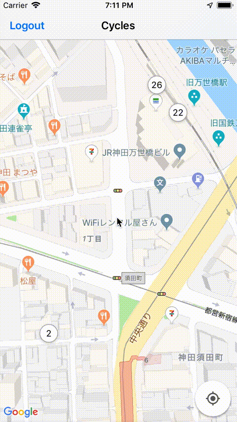

# Cycles

iOS app for finding and renting cycles from the docomo cycle service :bike::tokyo_tower:

## Disclaimer
This is not officially associated with the docomo cycle service in any way.
Use at your own discretion within the terms of use of the docomo cycle service.

## Why?

The docomo cycle service is a great service, but maybe renting cycles could be a bit easier:

**Renting via web site**
- GOOD: clean and simple site
- BAD: it's hard to know which ports are near your current location

**Renting via iOS app**
- GOOD: you can see all ports on a map, but...
- BAD: to actually view cycle for a port, you have to login to the web site via a web view
- :moneybag: possibly it is like this to avoid having to pay 30% of subscription revenue to the App Store :moneybag:


So, I created this simple app to let me see all the ports with cycle counts on a map and rent one.\
<sup>(and I could play around with Swift, which was the main reason really)</sup>

Here's the general idea:



## Installation

To set this up locally:

```sh
git clone https://github.com/dan-ess/Cycles/Cycles.git
cd Cycles
carthage update
```

Also create a Development.Config in the Configs dir, with an entry for Map SDK:

```
gms_api_key = <your_key>
```

## To do
Make the UI less ghetto
